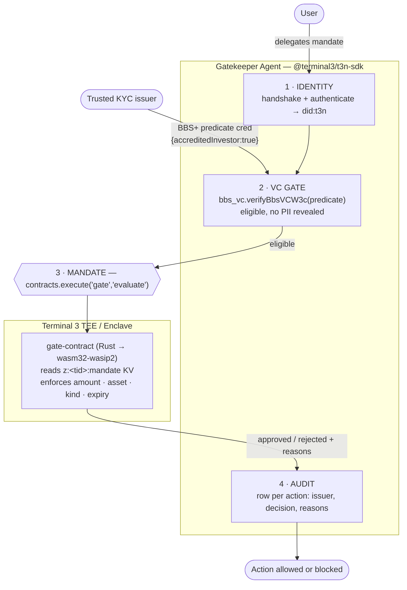

# Gatekeeper Agent — Terminal 3 Agent Dev Kit Bounty (Launch Ed)

[](https://github.com/PugarHuda/t3-gatekeeper-agent/actions/workflows/ci.yml)

> A delegated agent that executes **permissioned financial actions on behalf of a
> user without holding their credentials or sensitive data**. Eligibility is
> proven by a **BBS+ verifiable credential**; the spending bound is enforced by a
> **TEE contract in hardware**; every action is **audited**.

This submission deliberately exercises **all four layers** of the Terminal 3 SDK
in one coherent flow — not just authentication — to maximise the *"how well
integrated is the SDK in its entirety"* criterion.




```
┌─ Gatekeeper Agent (TypeScript / @terminal3/t3n-sdk) ───────────────────────┐
│ 1. IDENTITY   handshake() + authenticate()            → did:t3n            │
│ 2. VC GATE    bbs_vc.verifyBbsVCW3c(predicateCred)    → eligible, no PII   │
│ 3. MANDATE    contracts.execute("gate", "evaluate")   → TEE decision       │
│ 4. AUDIT      structured row (issuer, decision, reasons)                   │
└────────────────────────────────────────────────────────────────────────────┘
        │                                   │
   @terminal3/bbs_vc + vc_core      gate-contract (Rust → wasm32-wasip2)
   (predicate credential)           reads mandate from z:<tid>:mandate KV,
                                    enforces amount / asset / kind /
                                    counterparty / valid-after / expiry
```

## Layout

| Path | What |
| --- | --- |
| `agent/` | The agent runtime (identity + VC gate + contract invoke + audit). `npm run demo`. |
| `gate-contract/` | The Rust→WASM TEE mandate contract. Builds to a wasm component, registered to the tenant. |
| `t3-qa/` | Verification sandbox — standalone smoke tests for each layer (auth, BBS+ issue/verify, tamper test, contract deploy + invoke, live TDX attestation parse). |
| `submission/` | Demo script, BUIDL description, Track B bug reports, [technical deep-dive](submission/TECH_DEEPDIVE.md) (BBS+ pairing + TDX quote layout), [verification log](submission/VERIFICATION.md), and an [adoption roadmap](submission/ADOPTIONS.md) (A2A / ERC-8004 / Web Bot Auth — cheap/high/out-of-box). |
| `agent/agent-card.json` | A2A + ERC-8004 style agent card (identity, skills, trust). |

## Verified end-to-end on T3N testnet

Every layer was run against the live testnet, not mocked:

- **Auth** — `handshake` → `authenticate` → `getUsage` (20,000 credits).
- **BBS+ VC** — issue (`bbs-2023` DataIntegrityProof) + verify; a tampered claim
  is correctly rejected (`isValid:false`), so the signature is enforced.
- **True selective disclosure** — issuer signs a full record, holder derives a ZK
  proof revealing only one claim, verifier accepts; forged value / wrong nonce
  rejected (`npm run demo:sd`).
- **TEE contract** — `gate-contract` compiled to a 156 KB wasm component,
  registered (`contract_id` returned), and `evaluate()` invoked inside the
  Enclave returning approved/rejected decisions with the cluster timestamp and
  tenant DID resolved host-side.
- **Stateful velocity limit** — `gate-contract` `spend()` (v0.3.0, contract_id
  160) tracks a cumulative per-window total in the contract's KV map and rejects
  once the running total would exceed the cap — **enforced across invocations in
  hardware** (`t3-qa/velocity-test.mjs`: 3 spends, the 3rd correctly rejected).

## Advanced SDK adoptions (shipped)

Beyond the core gate, the agent layer ships two ecosystem integrations the ADK
advertises (see [submission/ADOPTIONS.md](submission/ADOPTIONS.md)):

- **Web Bot Auth (RFC 9421)** — `agent/src/web-bot-auth.mjs` signs the agent's
  outbound action requests with Ed25519 HTTP Message Signatures
  (`tag="web-bot-auth"`) so a destination can verify the request came from this
  agent before acting. The "front door" used by Visa TAP / Mastercard Agent Pay.
- **A2A capability exchange** — `agent/src/a2a.mjs` lets two agents handshake by
  exchanging a BBS+ capability credential with **selective disclosure**: an agent
  proves one capability without revealing the rest of its manifest.

Both are covered by offline tests (`npm test` — 17 tests total).

## Quickstart

```bash
# 1. build the TEE contract  (Windows: see gate-contract/README.md for the gnu toolchain note)
cd gate-contract && cargo build --target wasm32-wasip2 --release && cd ..

# 2. run the agent
cd agent
cp .env.example .env        # paste T3N_API_KEY + DID from the token-claim page
npm install
npm run setup               # register the contract to your tenant
npm run demo                # identity -> VC gate -> TEE mandate -> audit
```

## Security note

The T3N API key grants full sandbox access and is shown only once on the claim
page. Keep it in `agent/.env` (gitignored); never commit or share it.
